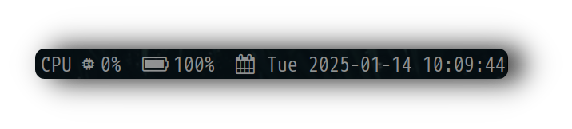

<div align="justify">

<div align="center">

```ocaml
CLICK OR TAP ❲☰❳ TO SHOW TABLE-OF-CONTENTS
```
</div>

</div>


<div align="center">
  <h2 style="font-size: 44px;">
    <strong> <a href="https://suckless.org/" style="text-decoration: none; color: inherit;">
      
      Dynamic Window Manager</a> 
    </strong>
  </h2>
</div>


‎ ‎ ‎ ‎ ‎ ‎ ‎ ‎ ‎ ‎ ‎ ‎ ‎ ‎ 
 ‎ ‎ ‎ ‎ ‎ ‎ ‎ ‎ ‎ ‎ ‎ ‎ ‎ 
## ⚙️ Features
- **Window Manager** :bento: [Dwm](https://dwm.suckless.org/)
- **Application Launcher** :rocket: [Dmenu](https://tools.suckless.org/dmenu/)
- **Terminal Emulator** :leaves: [Rxvt](http://software.schmorp.de/pkg/rxvt-unicode.html)
- **Shell** :shell: [Fish](https://fishshell.com/)
- **File Manager** :flower_playing_cards: [Thunar](https://docs.xfce.org/xfce/thunar/start)
  ‎ ‎ ‎ ‎ ‎ ‎ ‎ ‎ ‎ ‎ ‎ ‎ ‎ 
   ‎ ‎ ‎ ‎ ‎ ‎ ‎ ‎ ‎ ‎ ‎ ‎ ‎ 


<h1>
      <a href="#---------1">
      
</div>
</div> 
 ‎ ‎ ‎ ‎ ‎ ‎ ‎ ‎ ‎ ‎ ‎ ‎ ‎ 
  ‎ ‎ ‎ ‎ ‎ ‎ ‎ ‎ ‎ ‎ ‎ ‎ ‎ 
   ‎ ‎ ‎ ‎ ‎ ‎ ‎ ‎ ‎ ‎ ‎ 
 ‎ ‎ ‎ ‎ ‎ ‎ ‎ ‎ ‎ ‎ ‎ ‎ ‎ 
  ‎ ‎ ‎ ‎ ‎ ‎ ‎ ‎ ‎ ‎ ‎ ‎ ‎ 
   ‎ ‎ ‎ ‎ ‎ ‎ ‎ ‎ ‎ ‎ ‎ ‎ ‎ 
    ‎ ‎ ‎ ‎ ‎ ‎ ‎ ‎ ‎ ‎ ‎ ‎ ‎ 
    
</div>
      <a href="#---------1">
      
</div>
        <div style="display: flex; align-items: right; margin-bottom: 40px;">
  <div style="flex: 1; padding-right: 20px;">
    <p><strong>🚀 Resource Efficiency</strong></p>
    <p>Optimized for performance and minimal resource usage. <p>
</div>
    ‎ ‎ ‎ ‎ ‎ ‎ ‎ ‎ ‎ ‎ ‎ 
    ‎ ‎ ‎ ‎ ‎ ‎ ‎ ‎ ‎ ‎ ‎ 
    ‎ ‎ ‎ ‎ ‎ ‎ ‎ ‎ ‎ ‎ ‎ 
  <h1>
        <p><strong>Slstatus</strong></p>
<div style="display: flex; align-items: left; margin-bottom: 40px;">
  <div style="flex: 1; padding-right: 20px;">
  <p>This lightweight bar for dwm is designed for low resource usage not like polybar or others.</p>
</div>
      <a href="#---------1">
      
</div>
</div> 


  <h1>
        <p><strong>👁️ Center Neofetch</strong></p>
<div style="display: flex; align-items: left; margin-bottom: 40px;">
  <div style="flex: 1; padding-right: 20px;">
  <p>Clean Neofetch Config also included a center script already included.</p>
</div>
      <a href="#---------1">
      
</div>
</div> 
    ‎ ‎ ‎ ‎ ‎ ‎ ‎ ‎ ‎ ‎ ‎ 
  <h1>
        <p><strong>🏎️💨 Super Fast</strong></p>
<div style="display: flex; align-items: left; margin-bottom: 40px;">
  <div style="flex: 1; padding-right: 20px;">
  <p>This lightweight configuration maximizes system resources.</p>
</div>    ‎ ‎ ‎ ‎ ‎ ‎ ‎ ‎ ‎ ‎ ‎ 
    
## 🔑 Key Bindings

#### 📱 **Applications**

- **$mod+q** – KILL  
- **$mod+t** – RXVT
- **$mod+d** – DMENU


### :blossom: ‎ <samp>INSTALLATION (<a href="./REPOLOGY.md">DEPENDENCIES</a>)</samp>

<details>
<summary><b>1. Debian-based Linux distributions</b></summary>

[Debian SID](https://wiki.debian.org/DebianUnstable) or [Devuan (ceres?)](https://devuan.org/os/releases) recommended.

---

**X.Org server and {it's,core} utilities. This is essentials.**

```sh
xserver-xorg-core x11-xserver-utils psmisc
```

Contents of [1](https://packages.debian.org/sid/xserver-xorg-core),
[2](https://packages.debian.org/sid/x11-xserver-utils),
[3](https://packages.debian.org/sid/psmisc).

[Here for python (3) if not already installed](https://wiki.debian.org/Python).

---

**Now, the UI kits and functionality. This is required.**

URxvt is highly recommended terminal emulator by default. Picom is optional, but recommended.

```sh
 rxvt-unicode picom xorg-server xinit libX11 libXft libXinerama
```

Contents of [1](https://packages.debian.org/sid/libxft-dev),
[2](https://packages.debian.org/sid/libxinerama-dev),
[3](https://packages.debian.org/sid/rxvt-unicode),
[4](https://packages.debian.org/sid/feh),
[5](https://packages.debian.org/sid/picom),

[Here to install obmenu-generator](https://software.opensuse.org/download.html?project=home%3AHead_on_a_Stick%3Aobmenu-generator&package=obmenu-generator).

---

**Audio-server and audio stuff.**

I personally use pulseaudio, mpd and ncmpcpp are recommended as they are integrated by default.

```sh
pulseaudio mpd mpc ncmpcpp
```

Contents of [1](https://packages.debian.org/sid/pulseaudio),
[2](https://packages.debian.org/sid/mpd),
[3](https://packages.debian.org/sid/mpc),
[4](https://packages.debian.org/sid/ncmpcpp).

MPRIS-enabled media players are also integrated, such as [spotify](https://wiki.debian.org/spotify).

---

**Extended utilities. Required, but just as necessary.**

All of the below if not installed, certain functionality will display a message when needed, some will not.

```sh
alsa-utils brightnessctl imagemagick scrot w3m-img wireless-tools xclip xsettingsd xss-lock
```

Contents of [1](https://packages.debian.org/sid/alsa-utils),
[2](https://packages.debian.org/sid/brightnessctl),
[3](https://packages.debian.org/sid/imagemagick),
[4](https://packages.debian.org/sid/scrot),
[5](https://packages.debian.org/sid/w3m-img),
[6](https://packages.debian.org/sid/wireless-tools),
[7](https://packages.debian.org/sid/xclip),
[8](https://packages.debian.org/sid/xsettingsd),
[9](https://packages.debian.org/sid/xss-lock).

Choose your own polkit authentication-agent. [lxpolkit](https://packages.debian.org/sid/lxpolkit)?

---

```sh
thunar thunar-archive-plugin thunar-volman ffmpegthumbnailer tumbler
```

Contents of [1](https://packages.debian.org/sid/thunar),
[2](https://packages.debian.org/sid/thunar-archive-plugin),
[3](https://packages.debian.org/sid/thunar-volman),
[4](https://packages.debian.org/sid/ffmpegthumbnailer),
[5](https://packages.debian.org/sid/tumbler).


```sh
htop neofetch
```

Contents of [1](https://packages.debian.org/sid/htop),
[2](https://packages.debian.org/sid/neofetch).

[Here for improved nanorc with syntax-highlighting](https://github.com/scopatz/nanorc).

I personally use NetworkManager (and IWD as wireless back-end) with nm-applet,
[here it is](https://wiki.debian.org/NetworkManager).

</details>

<details>
<summary><b>1. Arch-based Linux distributions</b></summary>

[Arch Linux](https://archlinux.org) and [Artix Linux](https://artixlinux.org) recommended.

**Didn't know how to install packages?**

```sh
💲 sudo pacman -S atom1 atom2 ... atomN
```

---

**X.Org server and {it's,core} utilities. This is essentials.**

```sh
xorg-server xorg-xrandr xorg-xrdb psmisc
```

Contents of [1](https://archlinux.org/packages/extra/x86_64/xorg-server),
[2](https://archlinux.org/packages/extra/x86_64/xorg-xrandr),
[3](https://archlinux.org/packages/extra/x86_64/xorg-xrdb),
[4](https://archlinux.org/packages/core/x86_64/psmisc).

[Here for python (3) if not already installed](https://wiki.archlinux.org/title/python).

---

**Now, the UI kits and functionality. This is required.**

URxvt is highly recommended terminal emulator by default. Picom is optional, but recommended.

> **AUR**  
> `rxvt-unicode-truecolor-wide-glyphs`  
> `obmenu-generator`

```sh
dunst nitrogen openbox rofi rxvt-unicode-truecolor-wide-glyphs tint2 picom obmenu-generator perl-gtk3
```

Contents of [1](https://archlinux.org/packages/extra/x86_64/libxft/),
[2](https://aur.archlinux.org/packages/rxvt-unicode-truecolor-wide-glyphs),
[3](https://archlinux.org/packages/community/x86_64/picom),
[4](https://archlinux.org/packages/extra/x86_64/libxinerama/),
[5](https://archlinux.org/packages/extra/x86_64/feh/).

---

**Audio-server and audio stuff.**

I personally use pulseaudio, mpd and ncmpcpp are recommended as they are integrated by default.

```sh
pulseaudio pulseaudio-alsa mpd mpc ncmpcpp
```

Contents of [1](https://archlinux.org/packages/extra/x86_64/pulseaudio),
[2](https://archlinux.org/packages/extra/x86_64/pulseaudio-alsa),
[3](https://archlinux.org/packages/extra/x86_64/mpd),
[4](https://archlinux.org/packages/extra/x86_64/mpc),
[5](https://archlinux.org/packages/community/x86_64/ncmpcpp).

MPRIS-enabled media players are also integrated, such as [spotify](https://wiki.archlinux.org/title/spotify).

---

**Extended utilities. Required, but just as necessary.**

All of the below if not installed, certain functionality will display a message when needed, some will not.

```sh
alsa-utils brightnessctl imagemagick scrot w3m wireless_tools xclip xsettingsd xss-lock
```

Contents of [1](https://archlinux.org/packages/extra/x86_64/alsa-utils),
[2](https://archlinux.org/packages/community/x86_64/brightnessctl),
[3](https://archlinux.org/packages/extra/x86_64/imagemagick),
[4](https://archlinux.org/packages/community/x86_64/scrot),
[5](https://archlinux.org/packages/extra/x86_64/w3m),
[6](https://archlinux.org/packages/core/x86_64/wireless_tools),
[7](https://archlinux.org/packages/extra/x86_64/xclip),
[8](https://archlinux.org/packages/community/x86_64/xsettingsd),
[9](https://archlinux.org/packages/community/x86_64/xss-lock).

Choose your own polkit authentication-agent.
[polkit-gnome](https://archlinux.org/packages/community/x86_64/polkit-gnome)?

---

**Additionals for completion of desktop compositions.**

Just like mpd and ncmpcpp, configurations are included as [EXTRA_JOYFUL](./EXTRA_JOYFUL), some are integrated.

```sh
thunar thunar-archive-plugin thunar-volman ffmpegthumbnailer tumbler
```

Contents of [1](https://archlinux.org/packages/extra/x86_64/thunar),
[2](https://archlinux.org/packages/extra/x86_64/thunar-archive-plugin),
[3](https://archlinux.org/packages/extra/x86_64/thunar-volman),
[4](https://archlinux.org/packages/extra/x86_64/ffmpegthumbnailer),
[5](https://archlinux.org/packages/extra/x86_64/tumbler).

Gsimplecal was used to display calendar pop-ups from the tint2 panel, and pavucontrol to control pulseaudio-sinks.

```sh
geany geany-plugins gimp gsimplecal inkscape mpv parcellite pavucontrol viewnior xfce4-power-manager
```

Contents of [1](https://archlinux.org/packages/community/x86_64/geany),
[2](https://archlinux.org/packages/community/x86_64/geany-plugins),
[3](https://archlinux.org/packages/extra/x86_64/gimp),
[4](https://archlinux.org/packages/community/x86_64/gsimplecal),
[5](https://archlinux.org/packages/extra/x86_64/inkscape),
[6](https://archlinux.org/packages/community/x86_64/mpv),
[7](https://archlinux.org/packages/community/x86_64/parcellite),
[8](https://archlinux.org/packages/extra/x86_64/pavucontrol),
[9](https://archlinux.org/packages/community/x86_64/viewnior),
[10](https://archlinux.org/packages/extra/x86_64/xfce4-power-manager).

I personally don't use neofetch anymore and use system-information via rofi, it's already scripted.

```sh
htop nano #neofetch
```

Contents of [1](https://archlinux.org/packages/extra/x86_64/htop),
[2](https://archlinux.org/packages/core/x86_64/nano),
[3](https://archlinux.org/packages/community/any/neofetch).

[Here for improved nanorc with syntax-highlighting](https://github.com/scopatz/nanorc).

I personally use NetworkManager (and IWD as wireless back-end) with nm-applet,
[here it is](https://wiki.archlinux.org/title/NetworkManager#Front-ends).

</details>

</details>

### :hibiscus: ‎ <samp>INSTALLATION (PREREQUISITES)</samp>

<details>
<summary><b>1. Fonts</b></summary>

| Typefaces                                                                                                                 | License                                                                         | The path of extracted files from the archive        |
|:--------------------------------------------------------------------------------------------------------------------------|:--------------------------------------------------------------------------------|:----------------------------------------------------|

| [Feather IcoMoon](https://github.com/owl4ce/dotfiles/releases/download/ng/Feather.ttf)                                    | [MIT](https://github.com/feathericons/feather/blob/master/LICENSE) ([FAQ](https://icomoon.io/#faq/license))                           |
| [Material IcoMoon](https://github.com/owl4ce/dotfiles/releases/download/ng/Material.ttf)                                  | [Apache-2.0](https://github.com/Templarian/MaterialDesign/blob/master/LICENSE)                                                        |
| [Iosevka Nerd Font ... Mono](https://github.com/owl4ce/dotfiles/releases/download/ng/Iosevka.Nerd.Font.Complete.Mono.ttf) | [LICENSE](https://github.com/ryanoasis/nerd-fonts/blob/master/LICENSE)                                                                |
| [M+ 1mn Nerd Font Complete](https://github.com/owl4ce/dotfiles/releases/download/ng/M+.1mn.Nerd.Font.Complete.ttf)        | [LICENSE](https://github.com/ryanoasis/nerd-fonts/blob/master/LICENSE)                                                                |
| [M+ 1mn Nerd Font ... Mono](https://github.com/owl4ce/dotfiles/releases/download/ng/M+.1mn.Nerd.Font.Complete.Mono.ttf)   | [LICENSE](https://github.com/ryanoasis/nerd-fonts/blob/master/LICENSE)                                                                |
| [GNU Unifont](https://unifoundry.com/pub/unifont/unifont-14.0.02/font-builds/unifont-14.0.02.ttf)                         | [LICENSE](https://unifoundry.com/LICENSE.txt)                                                                                         |

**Wget** all the above fonts (and extract if archived). Then, put them as instructed into the `~/.fonts` directory.

```bash
 mkdir -pv ~/.fonts/
```

---

```bash
 wget --no-hsts -cNP ~/.fonts/IcoMoon-Custom/ https://github.com/owl4ce/dotfiles/releases/download/ng/{Feather,Material}.ttf
```

```sh
 wget --no-hsts -cNP ~/.fonts/Nerd-Patched/ https://github.com/owl4ce/dotfiles/releases/download/ng/M+.1mn.Nerd.Font.Complete.ttf
```

```bash
 wget --no-hsts -cNP ~/.fonts/Nerd-Patched/ https://github.com/owl4ce/dotfiles/releases/download/ng/{M+.1mn,Iosevka}.Nerd.Font.Complete.Mono.ttf
```


---

<details>
<summary><b>3. Wallpapers</b></summary>

|                                             Wallpapers                                                     |   The path where it will be put |
|:-----------------------------------------------------------------------------------------------------------|:-------------|:-----------------|
| [Forest2](https://raw.githubusercontent.com/user7210unix/Greendwm/refs/heads/main/wallpaper/Forest2.png)|                 | `~/.wallpapers/` |
| [ForestMountain](https://raw.githubusercontent.com/user7210unix/Greendwm/refs/heads/main/wallpaper/ForestMountain.png) |  | `~/.wallpapers/` |
| [Bambus](https://github.com/user7210unix/Greendwm/blob/main/wallpaper/bambus.jpg?raw=true)|                               | `~/.wallpapers/` |
| [Bambus-forest](https://github.com/user7210unix/Greendwm/blob/main/wallpaper/bambusforest.png?raw=true) |                 | `~/.wallpapers/` |
| [Bridge](https://github.com/user7210unix/Greendwm/blob/main/wallpaper/bridge.png?raw=true) |                              | `~/.wallpapers/` |
| [Forest](https://github.com/user7210unix/Greendwm/blob/main/wallpaper/forest.png?raw=true) |                              | `~/.wallpapers/` |
| [Light](https://github.com/user7210unix/Greendwm/blob/main/wallpaper/light.jpg?raw=true) |                                | `~/.wallpapers/` |
| [Plants](https://github.com/user7210unix/Greendwm/blob/main/wallpaper/plants.png?raw=true) |                              | `~/.wallpapers/` |
| [Yellow](https://github.com/user7210unix/Greendwm/blob/main/wallpaper/yellow.jpg?raw=true) |                              | `~/.wallpapers/` |

> **DISCLAIMER!!!**  
> I don't own the artworks (because I couldn't find the link to the originals),

**Wget** all the above wallpapers and put them as instructed into the `~/.wallpapers` directory.

```bash
💲 mkdir -pv ~/.wallpapers/
```

---

```bash
💲 wget --no-hsts -cNP ~/.wallpapers/ https://raw.githubusercontent.com/user7210unix/Greendwm/refs/heads/main/wallpaper/Forest2.png
```

```bash
💲 wget --no-hsts -cNP ~/.wallpapers/ https://raw.githubusercontent.com/user7210unix/Greendwm/refs/heads/main/wallpaper/ForestMountain.png
```
```bash
💲 wget --no-hsts -cNP ~/.wallpapers/ https://github.com/user7210unix/Greendwm/blob/main/wallpaper/bambus.jpg?raw=true
```
```bash
💲 wget --no-hsts -cNP ~/.wallpapers/ https://github.com/user7210unix/Greendwm/blob/main/wallpaper/bambusforest.png?raw=true
```
```bash
💲 wget --no-hsts -cNP ~/.wallpapers/ https://github.com/user7210unix/Greendwm/blob/main/wallpaper/bridge.png?raw=true
```
```bash
💲 wget --no-hsts -cNP ~/.wallpapers/ https://github.com/user7210unix/Greendwm/blob/main/wallpaper/forest.png?raw=true
```

```bash
💲 wget --no-hsts -cNP ~/.wallpapers/ https://github.com/user7210unix/Greendwm/blob/main/wallpaper/light.jpg?raw=true
```

```bash
💲 wget --no-hsts -cNP ~/.wallpapers/ https://github.com/user7210unix/Greendwm/blob/main/wallpaper/plants.png?raw=true
```

```bash
💲 wget --no-hsts -cNP ~/.wallpapers/ https://github.com/user7210unix/Greendwm/blob/main/wallpaper/yellow.jpg?raw=true
```


<details>
<summary><b>4. Extensions (URxvt)</b></summary>

| Extensions                                                                                   | License                                                                           | Usability         |
|:---------------------------------------------------------------------------------------------|:----------------------------------------------------------------------------------|:------------------|
| [resize-font](https://raw.githubusercontent.com/simmel/urxvt-resize-font/master/resize-font) | [ISC](https://github.com/simmel/urxvt-resize-font/blob/master/resize-font#L2-L15) | Font resizer      |
| [tabbedex](https://raw.githubusercontent.com/mina86/urxvt-tabbedex/master/tabbedex)          | [GPL-3.0](https://github.com/mina86/urxvt-tabbedex/blob/master/LICENSE)           | Tab functionality |

**cURL** all the above perl-scripts and put them into the `~/.urxvt/ext` directory.

```sh
💲 mkdir -pv ~/.urxvt/ext
```

---

```sh
💲 (cd ~/.urxvt/ext/; curl -LO https://raw.githubusercontent.com/simmel/urxvt-resize-font/master/resize-font)
```

```sh
💲 (cd ~/.urxvt/ext/; curl -LO https://raw.githubusercontent.com/mina86/urxvt-tabbedex/master/tabbedex)
```

</details>

### :cherry_blossom: ‎ <samp>INSTALLATION (DOTFILES)</samp>

<details>
<summary><b>1. Synchronize minimal .files</b></summary>

You can clone or [download as archive](https://github.com/user7210unix/Greendwm/releases/download/1.0/Greendwm-main.zip).
Then, put all the .files in the dotfiles directory into the user's home directory.


```sh
 git clone --depth 1 --recurse-submodules https://github.com/user7210unix/Greendwm.git
```

```sh
💲 cd ~/Greenwm/dwm
```

```sh
💲 sudo make clean install && cd .. && slstatus && sudo make clean install && cd .. && dmenu && sudo make clean install && cd ..
```

```sh
💲 mv picom ~/.config/ && mv .Xresources ~/ && mv ~/.xinitrc
```
