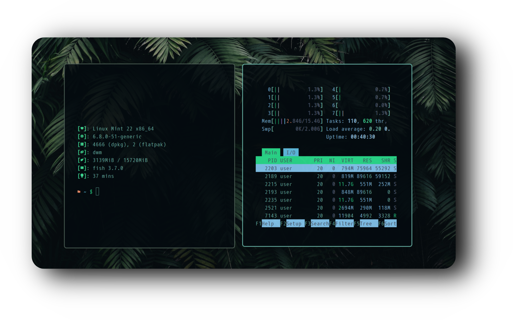
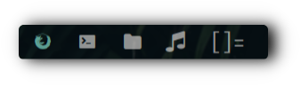
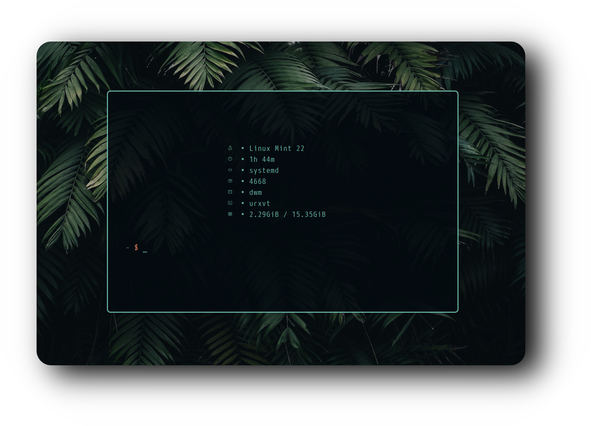

<div align="center">

  <h2 style="font-size: 54px;">
    <strong>
      <a href="https://suckless.org/" style="text-decoration: none; color: inherit;">
        
        Dynamic Window Manager
      </a>
    </strong>
  </h2>

</div>

<hr>

<h3>⚙️ Features</h3>
<ul>
  <li><strong>Window Manager</strong> :bento: <a href="https://dwm.suckless.org/">Dwm</a></li>
  <li><strong>Application Launcher</strong> :rocket: <a href="https://tools.suckless.org/dmenu/">Dmenu</a></li>
  <li><strong>Terminal Emulator</strong> :leaves: <a href="http://software.schmorp.de/pkg/rxvt-unicode.html">Rxvt</a></li>
  <li><strong>Shell</strong> :shell: <a href="https://fishshell.com/">Fish</a></li>
  <li><strong>File Manager</strong> :flower_playing_cards: <a href="https://docs.xfce.org/xfce/thunar/start">Thunar</a></li>
</ul>

<hr>

<h3>🚀 Features Breakdown</h3>
<div style="display: flex; align-items: center; justify-content: space-between; margin-bottom: 40px;">
  <div style="flex: 1; padding-right: 20px;">
    <p><strong>🚀 Resource Efficiency</strong></p>
    <p>Optimized for performance and minimal resource usage.</p>
  </div>
  
</div>

<h3><strong>Slstatus</strong></h3>
<div style="display: flex; align-items: center; justify-content: space-between; margin-bottom: 40px;">
  <div style="flex: 1; padding-right: 20px;">
    <p>This lightweight bar for dwm is designed for low resource usage, unlike Polybar and others.</p>
  </div>
  
</div>

<h3><strong>👁️ Center Neofetch</strong></h3>
<div style="display: flex; align-items: center; justify-content: space-between; margin-bottom: 40px;">
  <div style="flex: 1; padding-right: 20px;">
    <p>Clean Neofetch config, including a center script for better display.</p>
  </div>
  
</div>

<h3><strong>🏎️💨 Super Fast</strong></h3>
<div style="display: flex; align-items: center; justify-content: space-between; margin-bottom: 40px;">
  <div style="flex: 1; padding-right: 20px;">
    <p>This lightweight configuration maximizes system resources for better performance.</p>
  </div>
  
</div>

<hr>

<h3>🔑 Key Bindings</h3>
<h4>📱 Applications</h4>
<ul>
  <li><strong>$mod+q</strong> – Kill</li>
  <li><strong>$mod+t</strong> – Open RXVT</li>
  <li><strong>$mod+d</strong> – Open DMENU</li>
</ul>

<hr>

<h3>🛠️ Installation Guide</h3>

<p><strong>Follow these steps to set up the dotfiles on your system:</strong></p>

```bash
git clone https://github.com/user7210unix/Greendwm && cd Greendwm && \
mv config/picom ~/.config/ && mv config/neofetch ~/.config/ && \
cd dwm && sudo make clean install && cd .. && \
cd dmenu && sudo make clean install && cd .. && \
cd slstatus && sudo make clean install && cd .. && \
mv .Xresources ~/.Xresources && mv .xinitrc ~/.xinitrc && \
mkdir -pv ~/.fonts && cd ~/.fonts && \
wget https://github.com/owl4ce/dotfiles/releases/download/ng/Feather.ttf && \
wget https://github.com/owl4ce/dotfiles/releases/download/ng/Material.ttf && \
wget https://github.com/owl4ce/dotfiles/releases/download/ng/Iosevka.Nerd.Font.Complete.Mono.ttf && \
wget https://github.com/owl4ce/dotfiles/releases/download/ng/M+.1mn.Nerd.Font.Complete.ttf && \
wget https://github.com/owl4ce/dotfiles/releases/download/ng/M+.1mn.Nerd.Font.Complete.Mono.ttf && \
fc-cache -vf && clear && echo "Fonts Installed"
